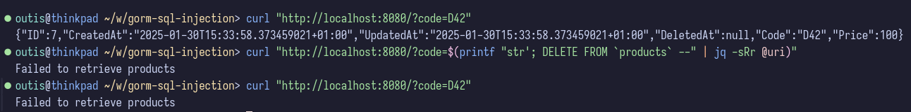
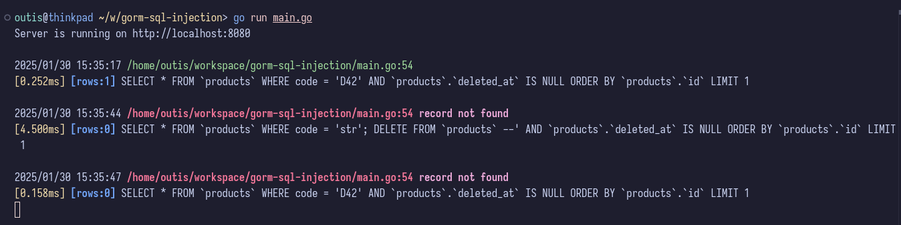

# Preventable SQL Vulnerabilities

I have encountered easily preventable SQL vulnerabilities multiple times during my relatively short career as a software developer, which I find quite disturbing. There is a single golden rule: once you see string manipulation of SQL commands being done using common methods, such as the fmt package in Go or the built-in string interpolation syntax of other languages, you should start to be suspicious.
While these methods may be acceptable in other contexts, they are not sufficient when it comes to database commands, as they bypass the built-in sanitization process of the database driver.

A common response to raising awareness about this issue is that potentially harmful user input is already validated elsewhere. While this may be true at the moment, who can say whether that will remain the case in the next five years or beyond? Implementing software with this in mind should be the norm for any type of software developer, whether they work for big-tech or for a smaller consulting company.

The following piece of code shows a vulnerable HTTP handler, using which a malicious user can effectively clear the entire production database of a web service with only a few HTTP calls:

```go
// Run arbitrary SQL command using the following pattern:
// curl "http://localhost:8080/?code=$(printf "str'; DELETE FROM `products` --" | jq -sRr @uri)"
func handleGet(w http.ResponseWriter, r *http.Request) {
    queryParams := r.URL.Query()
    var product Product

    // Avoid using manual string interpolation; instead, rely on the driver's string interpolation,
    // which should sanitize the SQL string as part of the concatenation process.
    if err := db.Debug().Where(fmt.Sprintf("code = '%v'", queryParams.Get("code"))).First(&product).Error; err != nil {
        //   Problematic line: ^^^^^^^^^^^^^^^^^^^^^^^^^^^^^^^^^^^^^^^^^^^^^^^^^^^
        http.Error(w, "Failed to retrieve products", http.StatusInternalServerError)
        return
    }

    w.Header().Set("Content-Type", "application/json")
    json.NewEncoder(w).Encode(product)
}
```

The next two images show the execution of this attack from the the malicious user and the server perspective. The running SQL strings are all printed out the console, so that we can follow the pairwise request and response in terms of what is happening with the database.



The user first requests a product using its code, "D42," and receives the associated data. However, because the "code" query parameter is not sanitized and the Gorm command is implemented incorrectly, an SQL injection attack can be executed. In this case, the attack string is "str'; DELETE FROM products --." The first part of this string closes the original command, allowing a new SQL command to be injected. The remaining part of the original string is then commented out using the "--" characters, making the second malicious command executable.

Subsequent calls to get the product data return no result, which means that all those resources have been deleted, so the attack was effective.



Similar avoidable usages are described in the original Gorm documentation: <https://gorm.io/docs/security.html>

More examples for harmful strings: <https://owasp.org/www-community/attacks/SQL_Injection>

The source code of this example can be found at <https://github.com/kerezsiz42/gorm-sql-injection>
